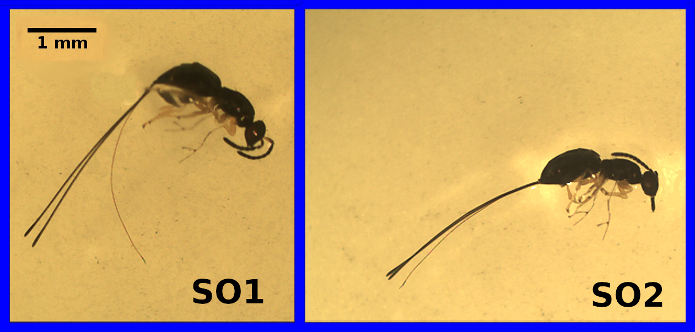

```{r, echo = FALSE}
set.seed(100);
```

Aim
================================================================================

The aim of this lecture is to introduce the randomisation approach to statistical hypothesis testing. We will first introduce the general idea of what randomisation is and how it relates to the hypothesis testing that we have been doing since week five. We will then consider an instructive example in which a randomisation approach is used in place of a traditional t-test to test whether or not the mean values of two different groups are identical. We will then compare the assumptions underlying randomisation and how they differ slightly from the assumptions of traditional hypothesis testing. We will then look at how randomisation can be used to build confidence intervals and test hypotheses that would difficult to test with other approaches. In learning aobut randomisation approaches, we will also review some key concepts from earlier in the module. **The aim is not to understand all of the nuances of randomisation, but to understand, conceptually, what is going on in the methods described below**.


Introduction to the randomisation approach
================================================================================

Throughout this module, we have conducted hypothesis tests in a similar way. We have calculated some test statistic (e.g., a t-statistic, F-statistic, or a Chi-square statistic), then compared our calculated statistic to the theoretical distribution that the statistic will take assuming that the null hypothesis is true (e.g., t-distribution, F-distribution, or Chi-square distribution). In doing this, our general question has been, 'if this is the probability distribution of test statistic values when our null hypothesis true, then what is the probability of getting the actual test statistic, or one more extreme than it, from this distribution' -- i.e., what is the p-value? Typically, our null distribution makes several assumptions about the data, such as that they are normally distributed. When these assumptions are violated, we then need to apply a transformation of some sort to the data, or to use a different non-parametric approach to testing our null hypothesis.

Randomisation takes a different approach to null hypothesis testing. Instead of assuming a theoretical null distribution against which we compare our test statistic, we ask, 'if the ordering of the data we collected was actually random, then what is the probability of getting a test statistic as or more extreme than the one that we actually did'. Rather than using a null distribution derived from statistical theory (which is what we have been doing, though we have not explained the theory underlying the shapes of the t, F, Chi-square, or other distributions; see @Freund2004 if this interests you), we will build the null distribution by randomising our data in some useful way. Conceptually, most students actually find randomisation methods easier to understand. Unfortunately, these methods are more challenging to implement in practice (we will not ask you to do them, just to understand them). The best way to get started is with an instructive example.


An instructive example
================================================================================

The data set used here is inspired by the many species of wasps that lay their eggs in the flowers of the Sonoran Desert rock fig (*Ficus petiolaris*). This tree is distributed throughout the Baja peninsula, and in parts of mainland Mexico. Fig trees and the wasps that develop inside of them have a fascinating ecology, but for now we will just focus on the morphologies of two closely related species as an example. The fig wasp below are two unnamed species of the genus *Idarnes*, which can refer to simply as 'Short-ovipositor 1' (SO1) and 'Short-ovipositor 2' (SO2). 




The reason that these two species are called 'SO1' and 'SO2' is that there is actually another species that lays its eggs in *F. petiolaris* flowers, one with an ovipositor that is at least twice as long as the ones above. 

Suppose that we have some data on the lengths of the ovipositors from each species. We might want to know whether the mean ovipositor length differs between the two species. Below shows the ovipositor lengths collected from 32 fig wasps, 17 of the species 'SO1', and 15 of the species 'SO2'.


```{r, echo = FALSE}
library(knitr);
sp   <- c(rep("SO1", 17), rep("SO2", 15))
eg   <- c(3.256, 3.133, 3.071, 2.299, 2.995, 2.929, 3.291, 2.658, 3.406, 
          2.976, 2.817, 3.133, 3.000, 3.027, 3.178, 3.133, 3.210, 3.014, 
          2.790, 2.985, 2.911, 2.914, 2.724, 2.967, 2.745, 2.973, 2.560, 
          2.837, 2.883, 2.668, 3.063, 2.639);
wp   <- as.data.frame(cbind(sp, eg));
colnames(wp) <- c("Species", "Ovipositor length (mm)");
sp1 <- as.numeric(as.character(wp[wp[,1]=="SO1",2]));
sp2 <- as.numeric(as.character(wp[wp[,1]=="SO2",2]));
tmo <- t.test(sp1, sp2, var.equal = TRUE);
kable(wp);
```


To test whether or not mean ovipositor length is different between these two fig wasps, our standard approach would be to use a two sample t-test. To review, our null hypothesis would be that the two means are the same, and our alternative (two-sided) hypothesis would be that the two means are not the same. We would need to check the assumption that the data are normally distributed, and that both samples have similar variances. Assuming that the assumption of normality is not violated (in which case we would need to consider a Mann Whitney test), and that both groups had similar variances (we can use an F test to check), we could proceed with calculating our t-statistic for unequal sample size,

$$t = \frac{mean(SO1) - mean(SO2)}{s_{p}}.$$

The $s_{p}$ is just being used as a short-hand to indicate the pooled standard deviation,

$$s_{p} = \sqrt{ \left(\frac{(n_{1} - 1)s^{2}_{1} + (n_{2} - 1)s^{2}_{2}}{n_{1} + n_{2} - 2} \right)  \left(\frac{n_{1} + n_{2}}{n_{1}n_{2}} \right)}.$$

Values of n1 and n2 are the sample sizes for SO1 (17) and SO2 (15), respectively, and $s^{2}_{1}$ and $s^{2}_{2}$ are the sample variances for SO1 and SO2, respectively. After we calculate our t-statistic, we could then use a critical value table to determine whether or not our p-value is below 0.05, or we could run our t-test using statistical software such as SPSS to test the null hypothesis for us. If we do all of this, then we would find that we get a t-statistic of `r as.numeric(tmo$statistic)` with 30 degrees of freedom, and our p-value would be `r as.numeric(tmo$p.value)`. The mean ovipositor length of SO1 was `r mean(sp1)` mm, and the mean ovipositor length of SO2 was `r mean(sp2)` mm. Hence, we would reject our null hypothesis and conclude that the difference between the group means (`r mean(sp1)` - `r mean(sp2)` = `r mean(sp1)-mean(sp2)`) is statistically significant.

**What if we took a different approach?** If there really is no difference between group means, then we should be able to randomly shuffle group identities (species) and get a difference between means that is not far off the one we actually get from the data. In other words, what would the difference between group means be if we just mixed up all of the species (so some SO1s become SO2s, some SO2s become SO1s, some stay the same), then calcualted the difference betwen means of the mixed up groups? If we just do this once, we cannot learn much. But if we randomly shuffle the groups many, many times (say at least 9999), then we could see what the difference between group means would look like just by chance; that is, if ovipositor length really was not different between SO1 and SO2. We could then compare our actual difference between mean ovipositor lengths to this null distribution, in which the difference between groups means really is random (it has to be, we randomised the groups ourselves!).

Use [this app](https://bradduthie.shinyapps.io/randomisation/) to try randomisation between groups. First notice that the data are ordered as they are in the table above. Species identity is in the first table column (SO1 in orange, SO2 in blue), and ovipositor length is in the second table column. The red value with the arrow pointing to it indicating 'Observered' is our actual difference (about 0.185 mm). Now we are going to look at the differences when we shuffle all of the groups in the first data column. Note that all of the values in the second data column will not change; we are just going to randomly shuffle the species identities in the first column. Do this by clicking 'Randomise'. Notice how the order of species identities has completely changed. We then calculate the difference between group means given these new species identities; the difference is shown at the top of the plot, and is plotted in grey in the developing histogram. Keep clicking 'Randomise' to see our null distribution of group mean differences build up. As the histogram continues to be built, we can start to see the answer to our question, "if species identity is random with respect to ovipositor length, then how unusual is the difference between species means that we observed"?

With modern computing power, we do not need to do this randomisation manually. A desktop computer can easily reshuffle the species identities and calculate a difference between means thousands of times in less than a second. The histogram below shows the distribution of the difference between species mean ovipositor length if we were to randomly reshuffle groups 9999 times. 

```{r, echo = FALSE}
iter <- 9999;          
diff <- NULL; 
N    <- dim(wp)[1];
ovi  <- as.numeric(as.character(wp[,2]));
for(i in 1:iter){   
    samp    <- sample(x = wp[,1], size = N, replace = FALSE);
    smpm    <- as.numeric(tapply(X = ovi, INDEX = samp, FUN = mean))
    diff[i] <- smpm[1] - smpm[2];
}
par(mar = c(5, 5, 1, 1));
hist(x = diff, main = "", xlab = "Random mean difference (mm)", cex.axis = 1.25,
     cex.lab = 1.25, col = "grey");
df1 <- mean(sp1) - mean(sp2);
arrows(x0 = df1, x1 = df1 , y0 = 500, y1 = 10, 
               length = 0.15, lwd = 4, col = "red");
more_extr <- sum(abs(diff) > abs(mean(sp1)-mean(sp2)));
```

Given this distribution random mean differences between species ovipositor lengths, our observed difference of `r mean(sp1)-mean(sp2)` appears to be fairly extreme. We can quantify how extreme by figuring out the proportion of mean differences in the above histogram that are as or more extreme than our observed difference. It turns out that only `r more_extr` out of `r iter` random mean differences between ovipositor lengths were greater than or equal to our observed difference of `r mean(sp1)-mean(sp2)`. To express this as a probability, we can simply take the number of differences as or more extreme than our observed difference (including the observed one itself), divided by the total number of differences (again, including the observed one),

$$P = \frac{`r more_extr` + 1}{`r iter` + 1}.$$

When we calculate the above, we get a value of `r (more_extr + 1)/(iter + 1)`. Notice that the calculated value is assigned with a 'P'. This is because the value **is a p-value** (technically, an unbiased estimate of a p-value). Consider how close it is to the value of `r as.numeric(tmo$p.value)` that we got from the traditional t-test. Conceptually, we are doing the same thing in both cases; we are comparing a test statistic to a null distribution to see how extreme the differences between groups really are.

Not restricted to t-tests 
================================================================================

The above example was just to illustrate the idea of randomisation, so a very simple hypothesis test was used. Notice, however, that we are not restricted to shuffling categorical groups like 'SO1' and 'SO2'. If, for example, we wanted to use randomisation to test the null hypothesis that two variables are uncorrelated, we could simply randomise one of the variables while keeping the other constant. For example, if we wanted to test the null hypothesis that ovipositor length in SO1 is not correlated to head length, then we could first calculate the actual correlation between ovipositor length and head length. Next, we could shuffle the head length values many times, calculating the correlation coefficient after each shuffle. We could then build a histogram like the one above, but with 'Random correlation' isntead of 'Random mean difference'. It can get a bit more challenging for more complex questions (e.g., multiple regressions or two-way ANOVAs), but the general principle works as long as we know what to randomise to build our null distribution.


Underlying assumptions of randomisation
================================================================================

Recall the assumptions underlying the standard two sample t-test for comparing two population means:

1. The data are collected from two independent groups of experiments/individuals.
2. The data are normally distributed
3. The obesrvations are independent of each other
4. Both samples have similar variances

There are some subtle differences in the assumptions underlying randomisation, but a benefit of the randomisation approach is that we do not need to make as many assumptions about the underlying data. We do not need assume 1-3. The randomisation approach is still valid even if the data are not normally distributed, the observations are not independent, and samples have different variances. This is can be quite useful!

The downside of the randomisation approach is that the statistical inferences that we make are limited to our sample. Because the randomisation method does not assume that the data are a random sample from the population of interest (as is the case for the traditional t-test), we cannot formally make an inference about the difference between populations from which the sample was made. This is not necessarily a problem in practice, however; it is only relevant in terms of the formal assumptions of the model. Once we run our randomisation test, it might be entirely reasonable to argue verbally that the results of our randomisation test can generalise to our population of interest; that is, that the difference between groups in the sample reflects a difference in the populations from which the sample came [@Ludbrook1998; @Ernst2004].


Bootstrapping confidence intervals
================================================================================

We also can use randomisation to calculate confidence intervals for a variable of interest. Remember that the traditional way to calculate upper and lower confidence intervals is as follows:

- Upper confidence interval: mean + constant * standard error
- Lower confidence interval: mean - constant * standard error

In the above, the mean is calculated in the usual way, and the standard error is the standard deviation divided by the square root of the sample size (n),

$$SE = \frac{s}{\sqrt{n}}.$$

The constant is either the t score or the z score that is appropriate for calculating the per cent confidence of interest. For example, 95 per cent of the probability density of the standard normal distribution lies between a z score of -1.96 and 1.96 (use [this app](https://bradduthie.shinyapps.io/zandp/) if you need a review). For a sufficiently large n (usually n > 30), we can therefore use a constant of 1.96. If n is less than or equal to 30, then we need to use the appropriate t score (use [this app](https://bradduthie.shinyapps.io/t_score/) for review) as our constant. Let us look again at the fig wasp ovipositor lengths, but only focus on lengths for SO1,

`r sp1`

To get the traditional 95 per cent confidence interval, we would calculate the following:

- The mean of SO1 ovipositor lengths is `r mean(sp1)` mm.
- The standard error is `r sd(sp1)` / sqrt(`r length(sp1)`) = `r sd(sp1)/sqrt(length(sp1))`
- The t-score for df = 17 - 1 is 2.120

We could therefore calculate the 95 per cent confidence intervals as follows:

- Upper confidence interval: `r mean(sp1)` + 2.120 * `r sd(sp1)/sqrt(length(sp1))` = `r mean(sp1) + (2.12 * sd(sp1)/sqrt(length(sp1)))`
- Lower confidence interval: `r mean(sp1)` + 2.120 * `r sd(sp1)/sqrt(length(sp1))` = `r mean(sp1) - (2.12 * sd(sp1)/sqrt(length(sp1)))`

**Again, we can try a different approach**. Instead of calculating the standard error and multiplying it by a z score or t score to encompass a particular interval of probability density, we can instead resample the data we have with replacement many times (we will get to what this means soon), calculating the mean each time we resample. The general idea is that this process of resampling approximates what would happen if we were to go back and resample new data from our original population many times, thereby giving us the distribution of means from all of these hypothetical resampling events [@Manly2007]. To calculate our 95 per cent confidence intervals, we then only need to rank the calculated means and find the mean closest to the lowest 2.5 per cent and the highest 97.5 per cent. Let us look again at those original values.

`r sp1`

The phrase 'resampling with replacement' just means that we are going to randomly sampled some values, but not remove them from the pool of possible values after they are sampled If we resample the numbers above with replacement, we might therefore sample some values two or more times by chance, and other values might not be sampled at all. The numbers below resample from the above with replacement.

```{r, echo = FALSE}
resamp1 <- sample(sp1, size = length(sp1), replace = TRUE);
```

`r resamp1`

Notice that some values appear twice in the data above, while other values that were present in the original data set are no longer present after resampling with replacement. Consequently, this new resampled data has a different mean than the original. The mean of our original 17 values was `r mean(sp1)`, and the mean of the values resampled above is `r mean(resamp1)`. We can resample another set of numbers to get a new mean.

```{r, echo = FALSE}
resamp2 <- sample(sp1, size = length(sp1), replace = TRUE);
```

`r resamp2`


The mean of the above sample is `r mean(resamp2)`. We can continue doing this process (not by hand, of course, but with a coputer program or code) until we have a high number of random samples and means. Here is a distribution of means if we did this process 10000 times.

```{r, echo = FALSE}
simpleboot <- function(freqs,repli=10000,alpha=0.05){                        
	vals  <- NULL;                                                           
	i     <- 0;                                                            
	while(i < repli){                                                          
		boot  <- sample(x=freqs,size=length(freqs),replace=TRUE);               
		strap <- mean(boot);                                                  
		vals  <- c(vals,strap);                                             
		i     <- i + 1;                                                       
	}                                                                      
	vals   <- sort(x=vals,decreasing=FALSE);                                 
	lowCI  <- vals[round((alpha*0.5)*repli)];                              
	highCI <- vals[round((1-(alpha*0.5))*repli)];                          
	CIs    <- c(lowCI,highCI);                                               
	return(list(vals, CIs));                                                             
} 
booteg <- simpleboot(freqs = sp1);
vals   <- booteg[[1]];
hist(x = vals, main = "", xlab = "Bootstrapped mean values", cex.axis = 1.25,
     cex.lab = 1.25, col = "grey", breaks = 20);
egLCI <- booteg[[2]][1];
egUCI <- booteg[[2]][2];
arrows(x0 = egLCI, x1 = egLCI , y0 = 500, y1 = 10, 
               length = 0.15, lwd = 4, col = "red");
arrows(x0 = egUCI, x1 = egUCI , y0 = 500, y1 = 10, 
               length = 0.15, lwd = 4, col = "red");
```

The red arrows show the locations of the 2.5 per cent and 97.5 per cent ranked values of the bootstrapped means. Note that it does not matter if the above distribution is not normal (it appears a bit skewed), the boostrap still works. Our values using the randomisation approach are as follows.

- Upper confidence interval: `r egUCI`
- Lower confidence interval: `r egLCI`

Compare these values to the confidence intervals calculated with the traditional approach.

- Upper confidence interval: `r mean(sp1) + (2.12 * sd(sp1)/sqrt(length(sp1)))`
- Lower confidence interval: `r mean(sp1) - (2.12 * sd(sp1)/sqrt(length(sp1)))`

The values are quite similar because we are doing the same thing, conceptually, using two different approaches. Note that if we tried this bootstrap again, we would get slightly different confidence intervals. 


Monte Carlo on spatial data
================================================================================

The previous examples of hypothesis testing and bootstrapping involved resampling from existing data sets to address a statistical question. But we can also use randomisation in cases in which it is impossible to derive the null distribution from the data. In this last example, **the goal will be to test whether or not fig trees are randomly distributed across a fixed sampling area.**


The locations of these fig trees were collected over the course of many field seasons. The first six rows of the data set with tree locations are shown below.

```{r, echo = FALSE}
fpet <- read.csv("data/FpetTrees.csv");
```


```{r, echo = FALSE}
lat1 <-  28.289;
lat2 <-  28.2918;
lon1 <- -113.1145;
lon2 <- -113.1095;
kable(head(fpet));
```

We can plot the latitude and longitude of each of the `r dim(fpet)[1]` trees below. The brown box shows the study plot at the field site, randomly set from latitude `r lat1` to `r lat2` and longitude `r lon1` to `r lon2`. 

```{r, fig.height = 7, fig.width = 7, echo = FALSE}
lat1 <-  28.289;
lat2 <-  28.2918;
lon1 <- -113.1145;
lon2 <- -113.1095;
plot(x = fpet[,4], y = fpet[,3], xlab = "Longitude", ylab = "Latitude",
     pch = 20, cex.lab = 1.25, cex.axis = 1.25, 
     xlim = c(lon1 - 0.001,  lon2 + 0.001), 
     ylim = c(lat1 - 0.0005, lat2 + 0.0005));
polygon(x = c(lon1, lon1, lon2, lon2),  y = c(lat1, lat2, lat2, lat1),
        col = "tan");
points(x = fpet[,4], y = fpet[,3], pch = 20);
```

The focal question is **whether or not these trees are randomly distributed within the brown box.** This is not a question that can be answered by randomising the latitude and longitude coordinates of trees. What we need to do instead is compare the distribution of the trees above with that of trees with randomly placed latitude and longitude coordinates within the box. This is a job for a **Monte Carlo** test, which compares an observed test statistic with that derived from a theoretical null model [@Manly2007]. In this case, the test statistic we will use is distance to the nearest neighbour (i.e., for a focal tree, how close the nearest member of the same species). The null model that we will assume is a set of randomly sampled latitude and longitude coordinates within the fixed study area.

More formally, our null hypothesis will be that the mean nearest neighour distance for a focal tree in the observed data will not differ significantly from the mean nearest neighour distance obtained form the same number of trees randomly distributed within the sampling area (brown box). To test this null hypothesis, we can randomly place `r dim(fpet)[1]` trees on the sampling area and calculate the mean nearest neighbour distance for the randomly placed trees. If we repeat this procedure a large number of times, then we can build a null distribution of nearest neighbour distances for trees that are randomly placed within the study are (i.e., random latitude and longitude coordinates). 

```{r, echo = FALSE}
get_mean_nearest_neighbour <- function(trees, lat = 3, lon = 4){
    N_trees  <- dim(trees)[1];
    tree_lat <- trees[,lat];
    tree_lon <- trees[,lon];
    nearests <- rep(x = NA, times = N_trees);
    for(i in 1:N_trees){
        nearest_neigh <- Inf;
        for(j in 1:N_trees){
            if(i != j){
                diff_lat <- tree_lat[i] - tree_lat[j];
                diff_lon <- tree_lat[i] - tree_lat[j];
                sq_lat   <- diff_lat * diff_lat;
                sq_lon   <- diff_lon * diff_lon;
                neigh_d  <- sqrt(sq_lat + sq_lon);
                if(neigh_d < nearest_neigh){
                    nearest_neigh <- neigh_d;
                }
            }
        }
    nearests[i] <- nearest_neigh;
    }
    return(mean(nearests));
}
```

Given the random placement of these trees, find the mean distance to the nearest neighbouring tree, calculated across all of the randomly placed trees. This mean nearest neighbour distance is then stored so that a null distribution can be built. We can see what these randomly placed trees look like by plotting some of the iterations below.


```{r, echo = FALSE}
iteration    <- 9999;
```


```{r, echo = FALSE, fig.height = 8, fig.width = 8}
iteration    <- 16;
N_trees      <- dim(fpet)[1];
simulated_NN <- NULL;
par(mfrow = c(4, 4), mar = c(0, 0, 0, 0));
while(iteration > 0){
    rand_lat  <- runif(n = N_trees, min = lat1, max = lat2);
    rand_lon  <- runif(n = N_trees, min = lon1, max = lon2);
    fpet[,3]  <- rand_lat;
    fpet[,4]  <- rand_lon;
    mean_NN   <- get_mean_nearest_neighbour(fpet);
    simulated_NN[iteration] <- mean_NN;
    plot(x = fpet[,4], y = fpet[,3], xlab = "", ylab = "",
         pch = 20, cex.lab = 1.25, cex.axis = 1.25, xaxt = "n", yaxt = "n",
         xlim = c(lon1 - 0.001,  lon2 + 0.001), 
         ylim = c(lat1 - 0.0005, lat2 + 0.0005));
    polygon(x = c(lon1, lon1, lon2, lon2),  y = c(lat1, lat2, lat2, lat1),
            col = "tan");
    points(x = fpet[,4], y = fpet[,3], pch = 20);
    iteration <- iteration - 1;
}
```

Below, the distribution of mean distance to the nearest neighbour is plotted for the 9999 randomly generated tree study areas. The arrow shows the actual observed mean distance between nearest neighbours, as calculated form the original data set.


```{r, echo = FALSE}
iteration    <- 9999;
N_trees      <- dim(fpet)[1];
simulated_NN <- NULL;
while(iteration > 0){
    rand_lat  <- runif(n = N_trees, min = lat1, max = lat2);
    rand_lon  <- runif(n = N_trees, min = lon1, max = lon2);
    fpet[,3]  <- rand_lat;
    fpet[,4]  <- rand_lon;
    mean_NN   <- get_mean_nearest_neighbour(fpet);
    simulated_NN[iteration] <- mean_NN;
    iteration <- iteration - 1;
}
hist(simulated_NN, xlab = "Mean tree nearest neighbour distance", 
     col = "grey", main = "", cex.lab = 1.5, cex.axis = 1.5, breaks = 20);
fpet <- read.csv("data/FpetTrees.csv");
obs  <- get_mean_nearest_neighbour(fpet)
arrows(x0 = obs, x1 = obs, y0 = 500, y1 = 10, lwd = 3, length = 0.1);
```

It appears, from the position of the mean tree nearest neighbour distance in the observed data, that the *F. petiolaris* trees are no more or less spatially aggregated than would be expected by chance.


Literature Cited
================================================================================


